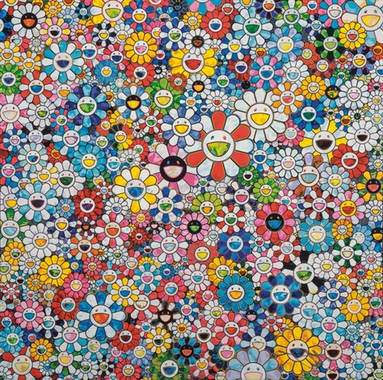

#Secrets to Happiness from the Crowd





\newline
\newline
\newline

What makes you happy? You may think it easy to answer, but it can also become complicated when we dig deeper. Happiness, as it turns out, can vary between groups of people and can take different forms. The question was asked to people and 100,000 crowd-sourced happy moments are collected to form HappyDB, by which we perform some exploratory data analysis here to unveil the secrets of happiness hidden inside.
```{r warning=FALSE, message=FALSE,echo=FALSE}
## install and load libraries
packages.used=c("tidyverse", "tidytext","DT", "scales", "wordcloud2", "gridExtra", "ngram",
                "shiny", "igraph", "ggraph", "wordcloud", "RColorBrewer", "plyr", "Hmisc",
                "plotrix", "ggpubr", "ggfortify")

# check packages that need to be installed.
packages.needed=setdiff(packages.used, 
                        intersect(installed.packages()[,1], 
                                  packages.used))
# install additional packages
if(length(packages.needed)>0){
  install.packages(packages.needed, dependencies = TRUE)
}

# load libraries
library(tidyverse)
library(tidytext)
library(DT)
library(scales)
library(wordcloud2)
library(gridExtra)
library(ngram)
library(shiny) 
library(igraph)
library(ggraph) 
library(wordcloud)
library(RColorBrewer)
library(plyr)
library(Hmisc)
library(plotrix)
library(ggpubr)
library(ggfortify)
```

```{r warning=FALSE, message=FALSE,echo=FALSE}
# load data for use
hm_data <- read_csv("../output/processed_moments.csv")

urlfile<-'https://raw.githubusercontent.com/rit-public/HappyDB/master/happydb/data/demographic.csv'
demo_data <- read_csv(urlfile)

urlfile2<-'https://raw.githubusercontent.com/rit-public/HappyDB/master/happydb/data/vad.csv'
vad_data <- read_csv(urlfile2)

urladr<-'https://raw.githubusercontent.com/rit-public/HappyDB/master/happydb/data/topic_dict/'
```

```{r warning=FALSE, message=FALSE,echo=FALSE}
# combine two data sets and keep the columns needed
hm_data <- hm_data %>%
  inner_join(demo_data, by = "wid") %>%
  select(hmid,
         wid,
         original_hm,
         gender, 
         marital, 
         parenthood,
         reflection_period,
         age, 
         country, 
         ground_truth_category,
         predicted_category,
         text) %>%
  mutate(count = sapply(hm_data$text, wordcount)) %>%
  filter(gender %in% c("m", "f")) %>%
  filter(marital %in% c("single", "married")) %>%
  filter(parenthood %in% c("n", "y")) %>%
  filter(reflection_period %in% c("24h", "3m")) %>%
  mutate(reflection_period = fct_recode(reflection_period, 
                                        months_3 = "3m", hours_24 = "24h"))
```

```{r warning=FALSE, message=FALSE,echo=FALSE}
# Create a bag of words using the text data
bag_of_words <-  hm_data %>%
  unnest_tokens(word, text)

word_count <- bag_of_words %>%
  dplyr::count(word, sort = TRUE)

```

##What makes different groups of people happy?

At first glance, "friend", "day" and "time" are by far the most frequent words mentioned by people in their happy moments. It appears that these words have some influence on our happiness. Maybe this somehow points out the importance of saying to our friends "Have a good time/day." 
```{r warning=FALSE, message=FALSE,echo=FALSE}
#produce a word cloud
set.seed(1)
wordcloud2(data = word_count[1:100,], shape = 'star', size = 0.6, backgroundColor = "lightsalmon" )

```


###Category Frequency
To answer the question, let's categorize the happy moments into 6 groups, namely, "achievement", "affection", "bonding", "enjoy_the_moment","leisure","nature" and "exercise". Although the category directly indicated by the respondents are generally unavailable, some process has been applied to create the predicted categories for the convenience of our analysis. As can be gleaned from the pie chart, two of the leading categories are "affection" and "achievement", followed by "enjoy_the_moment","bonding" and "leisure", with "nature" and "exercise" being the least mentioned. 
```{r warning=FALSE, message=FALSE,echo=FALSE}
# plot a pie chart of predicted category frequency
pred_cat = hm_data[,c(4:7,9,11)]
pred_cat$predicted_category = factor(hm_data$predicted_category, 
                                     levels = rev(c("achievement", "affection", "bonding",
                                                "enjoy_the_moment","leisure","nature","exercise")))
pred_cat_table = as.data.frame(sort(table(pred_cat$predicted_category), decreasing = TRUE))
names(pred_cat_table)[1]="category"

ggplot(data = pred_cat_table, aes(x=factor(1), y=Freq, fill=category))+
  geom_bar(width=1, stat="identity")+
  coord_polar(theta = "y")+
  labs(title = "Predicted Category Frequency", x = "Category", y = "Frequency")
```

###Comparison between Demographic Groups

While the overall pattern is quite clearcut, a comparison between groups only makes it more intriguing:
\newline
\newline
\newline

+ Women would put more emphasis of their happy moments on affection rather than achievement as compared to men, in line with the stereotype of the traditional duties of women and men, from which we can learn a bit what the current society structures are like: though far better than decades ago, gender equality is not something that can be easily achieved in every aspect and is a notion that needs more elaborate study.
\newline
\newline
\newline

+ A single person would put more weight on individual achievement, bonding, leisure and would enjoy the moment more, which are among the prerogatives of being single. But the affection brought by marriage could be another source of happiness.
\newline
\newline
\newline

+ It seems that being a parent will redirect a majority of your attention to your children which explains the evidence of a high proportion in affection for parents and the relatively low proportion in all other aspects.
\newline
\newline
\newline

+ The reflection period is not a feature to separate groups of people but can really affect your pondering on the happy moments. Achievement and affection are more likely to yield result in a longer period of time, and they are more macroscopic and influential than the comparatively more ephemeral feelings associated with bonding, enjoying the moment and leisure when we look back at a certain stage of our life.

```{r warning=FALSE, message=FALSE,echo=FALSE}
#bar charts: comparisons of category frequency in different groups
atrs <- c("gender", "marital", "parenthood", "reflection_period")
temp0 = list()

sql_cat = list()
for (i in 1:length(atrs)){
  sql_cat[[i]] = pred_cat%>%
                   dplyr::count(!!as.symbol(atrs[i]),predicted_category)%>%
                   group_by(!!as.symbol(atrs[i]),predicted_category)
}

sql_cat[[5]] = pred_cat%>%
  dplyr::count(country,predicted_category)%>%
  group_by(country,predicted_category)%>%
  filter(country %in% c("USA","IND"))

atrs[5]="country"
names(sql_cat)=atrs

divi <-function(vec,df){
  vec1 = as.vector(vec)
  if (as.character(vec1[1])==as.character(df[1,1])){
    vec1[3]=as.numeric(vec1[3])/as.numeric(df[1,2])
  }
  else{
    vec1[3]=as.numeric(vec1[3])/as.numeric(df[2,2])
  }
  return(vec1[3])
}
cnt_to_prop<-function(df){
  df = data.frame(df)
  df_sum = df%>%
    group_by(!!as.symbol(names(df)[1]))%>%
    dplyr::summarise(total = sum(n, na.rm = TRUE))
  df_sum = data.frame(df_sum)
  props = round(as.numeric(apply(df,1,divi,df_sum)),digits = 4)
  df[,3] = props
  names(df)[3]="proportion"
  return(df)
}
gen = data.frame(sql_cat[[1]])

ttt = data.frame(data.frame(sql_cat[[1]])%>%
    group_by(gender)%>%
    dplyr::summarise(total = sum(n)))
    
bi_cat<-function(df){
  df = cnt_to_prop(df)
  ggplot(data=df, aes(x=!!as.symbol(names(df)[2]),y=!!as.symbol(names(df)[3])))+
    geom_bar(aes(fill=!!as.symbol(names(df)[1])), position = "dodge", stat="identity")+
    coord_flip()
}

cat_plt = lapply(sql_cat[1:4], FUN = bi_cat )
ggarrange(cat_plt[[1]],cat_plt[[2]], cat_plt[[3]], cat_plt[[4]], common.legend=FALSE,legend = 'right', nrow=2, ncol=2)
```

\newline
\newline
\newline

Different from the above four features of gender, marital status, parenthood and reflection period, the nationalities of the respondents come in a great variety. However, the majority of them are from USA and India, with the former take up about 86.1% and the latter 8.9%, while all other 99 countries take up only 5%. Therefore, considering the huge basis of the responses, it might still be meaningful to compare the records between USA and India. 


\newline
\newline
\newline

It is interesting that even in different countries, the distributions of categories of happy moments differ. Americans find more happiness in achievement, nature and exercise, while indians emphasize affection, bonding, enjoying the moment and leisure more. The distinction of individualism in the US and family-orientation in India reveals itself. Isn't it wonderful that we can actually get a taste of the cultural differences simply from data mining in the happy moments people describe?

```{r warning=FALSE, message=FALSE,echo=FALSE}
#bar chart: comparisons of category frequency in USA and IND
bi_cat(sql_cat[[5]])
```


##What kind of happiness do you want?
After learning what makes different people happy, a very natural question to ask could be how to make you happier. However, this is indeed an ultimate question to ponder on even in a philosophical sense. In order to make our life easier, we might as well first ask: what kind of happiness do you want?

###EDA in Emotions Using the Valence-Arousal-Dominance(VAD) Model
The VAD model has been applied to each happy moment for evaluation, with valency representing the pleasantness of a stimulus, arousal standing for the intensity of emotion provoked by a stimulus and dominance, the degree of control exerted by a stimulus. The scores of each range from 0 - 10 with 5 being neutral. The comparison between the above mentioned 5 different ways of grouping turns out to be unconspicuous, therefore there is no need to put too much focus on it.


```{r warning=FALSE, message=FALSE,echo=FALSE}

# combine happy moments data with vad data
hm_data <- hm_data %>%
  inner_join(vad_data, by = "hmid") %>%
  select(hmid,
         wid,
         original_hm,
         gender, 
         marital, 
         parenthood,
         reflection_period,
         age, 
         country, 
         ground_truth_category,
         predicted_category,
         text,
         valency,
         dominance,
         arousal)
```


Both dominance(control) and valency(pleasantness) spread around the score of 5 to 6. And The relationship between the two, as imagined, basically takes on a linear form. Though expressing happiness, the emotion we can feel from the phrasing do not necessarily reflect it, as can be seen from the lower tail of the scores of valency.

\newline
\newline
\newline
```{r warning=FALSE, message=FALSE,echo=FALSE}
# scatter plot of dominance against valency and the regression fitting line
ggplot(data=hm_data)+
  geom_jitter(aes(x=valency, y=dominance), size =0.1, color = "antiquewhite4")+
  stat_smooth(data=subset(hm_data, valency>4 & valency <8),aes(x=valency, y=dominance),method = "lm", formula = y ~ x, size = 1)+
  labs(title = "Dominance VS Valency")
```

However, the case is more obscure for that between valency and arousal(intensity). It doesn't seem that the more pleasant it is, the more intense it is, but that arousal could be higher for both high and low valency, and the majority of the happy moments share a neutral or even lower arousal(around 4.2). As a matter of fact, the simplified shape of the scatter plot is kind of quadratic, making the regression fitting curve look like a "smile". But how come? Without using any advanced models, we can make a rudimentary division among the scattered points according to their locations. Though not rigorous, it doesn't hurt to collect more information from as convenient a tool as we have.
```{r warning=FALSE, message=FALSE,echo=FALSE}
# scatter plot of arousal against valency and the regression fitting curve
ggplot(data=hm_data)+
  geom_jitter(aes(x=valency, y=arousal), size =0.1, color = "tomato")+
  stat_smooth(data=subset(hm_data, valency>4 & valency <8),aes(x=valency, y=arousal),method = "lm", formula = y ~ x + I(x^2), size = 1, color = "white")+
  labs(title = "Arousal VS Valency")
```

\newline
\newline
\newline

###Category Analysis in VAD with Subjective Groups
Here we create 3 subjective groups with 1 representing those happy moments with roughly high valency and high arousal, 2 wtih medium valency and low arousal and 3 with relatively low valency and not as low arousal. The groups are divided using K-means clustering. Again, there is not much scientific basis in this grouping as it can be easily eyeballed that there is certainly only one cluster. But the effect will be displayed as follows.
```{r warning=FALSE, message=FALSE,echo=FALSE}
# 3-Means Cluster Analysis
vad_data = data.frame(vad_data)
vad_data = cbind(vad_data[,1:2],vad_data$arousal,vad_data$dominance)
vad_ori = stats::na.omit(vad_data)
vad = vad_ori
vad[,2:4]= scale(vad_ori[,2:4])
hmid_vad = vad[,1]
va = vad[,2:3]
set.seed(1)
fit <- kmeans(va, 3)
km_vad <- data.frame(vad_ori, fit$cluster)
names(km_vad)[3:5] = c("arousal","dominance","subjective_group")
km_vad[which(km_vad[,5]==2),5]=0
km_vad[which(km_vad[,5]==1),5]=2
km_vad[which(km_vad[,5]==0),5]=1
km_vad$subjective_group = as.factor(km_vad$subjective_group)

#color the scatter plot in different subjective groups
ggplot(data = km_vad,aes(x=valency,y=arousal))+
  geom_point()+
  geom_point(aes(colour = subjective_group))+
  labs(title = "Subjective Grouping")
```

For each group, it won't hurt to analyze their category component separately. Surprisingly, there is a pattern. Though appearing most frequent in the crowd, achievement usually comes along with the lower valency and affection the opposite. It may be that although the path to success of one thing is tough, unpleasant and anti-instinct, the good result that comes with it makes such a big contrast that people actually get the most happiness out of it and the intensity can even be higher than a majority part of other kinds of happiness.

```{r warning=FALSE, message=FALSE,echo=FALSE}
#bar chart: comparison of proportion of categories in each subjective group
cat_vad = hm_data%>%
  inner_join(km_vad, by="hmid")%>%
  select(hmid,
         predicted_category,
         subjective_group)
cat_vad_cnt = data.frame(cat_vad%>%
  group_by(subjective_group)%>%
  dplyr::count(predicted_category))

cat_vad_cnt[,1]=factor(cat_vad_cnt[,1])
cnt_lst = split(cat_vad_cnt, f=cat_vad_cnt$subjective_group)
cnt_df = NULL
for(i in 1:3){
  cnt_lst[[i]]$proportion = round(cnt_lst[[i]]$n/sum(cnt_lst[[i]]$n),4)
  cnt_lst[[i]] = cnt_lst[[i]][,-3]
  names(cnt_lst[[i]])[1]="group"
  cnt_df = rbind(cnt_df, cnt_lst[[i]])
}
cnt_df$predicted_category = factor(cnt_df$predicted_category, levels = rev(c("achievement", "affection", "bonding", "enjoy_the_moment","leisure","nature","exercise")))

ggplot(data = cnt_df, aes(x=predicted_category,y=proportion,fill=group))+
  geom_bar(stat = "identity")+
  facet_wrap(as.formula("~group"), ncol = 3)+
  coord_flip()+
  labs(title = "Proportion of Categories in Each Group", x = "Predicted Category", y = "Proportion")
```


###Happy Moment Examples in Typical VAD Subjective Groups
Nevertheless, our curiosity cannot be satisfied if we stop the analysis here. A closer look at the real sentences in different groups of valency-arousal should help us understand more about the phenomenon. For each group, we select the most extreme 5 sentences to see where we are directed by the kind of happiness there.

Group 1, with high valency and arousal, tends to be those really pleasant and exciting activities in our common sense. These are usually the ordinary kind of happiness that we can immediately think about.

```{r warning=FALSE, message=FALSE,echo=FALSE}
# extract the 5 sentences with the highest valency
high_val=  head(hm_data[order(hm_data$valency,decreasing = TRUE),]$original_hm,5)
high_val
```

Take a glimpse at Group 2 - medium valency and low arousal, and you can actually get touched somehow. These are the moments that are so quiet and delicate that you need to have a peaceful and undisturbed mind to feel it. But there is no denying that these take on an alternative from of happiness other than that arise from an vacation.
```{r warning=FALSE, message=FALSE,echo=FALSE}
# extract the 5 sentences with the lowest arousal
low_aro = head(hm_data[order(hm_data$arousal,decreasing = FALSE),]$original_hm,5)
low_aro
```

Finally, Group 3 - low valency and medium arousal, seems to be as a whole born out of pain. The escape from a bad status (please ignore the fact that the 1st sentence is a sick extreme), while it sounds pathetic, is indeed a milestone for people in the situations. Think about it. Sometimes lowering our expectations can bring us additional surprise. Also, no achievement that can bring us happiness comes at ease - no pains, no gains.

```{r warning=FALSE, message=FALSE,echo=FALSE}
# extract the 5 sentences with the lowest valency
low_val = head(hm_data[order(hm_data$valency,decreasing = FALSE),]$original_hm,5)
low_val
```


##Summary
Put together, there are a variety of sources of happiness people receive depending on the groups they belong. But the bulk of happiness comes from the enjoyable time we spend with the people that are important to us and from the achievements we make, which make up the two major types of happiness. With a more detailed examination, the types of happiness people feel can be more subtle and they don't involve the same amount of effort to obtain. It is therefore our own decision to make to go after the right kind of happiness for ourselves when we are sometimes at sea where to find happiness.


##References
\newline
\newline
\newline

1.Images:
\newline
\newline
\newline

http://www.artnet.com/artists/takashi-murakami/the-future-will-be-full-of-smile-for-sure-and-q-q6e254cJOcZQq4FgnVgw2
\newline
\newline
\newline

http://magazine.ucla.edu/depts/quicktakes/street_smiles/
\newline
\newline
\newline

2.Paper:
\newline
\newline
\newline

https://arxiv.org/abs/1801.07746


=======
---
title: "R Notebook"
output:
  html_document: default
  html_notebook: default
---

#Secrets to Happiness from the Crowd


\newline
\newline
\newline

What makes you happy? You may think it easy to answer, but it can also become complicated when we dig deeper. Happiness, as it turns out, can vary between groups of people and can take different forms. The question was asked to people and 100,000 crowd-sourced happy moments are collected to form HappyDB, by which we perform some exploratory data analysis here to unveil the secrets of happiness hidden inside.
```{r warning=FALSE, message=FALSE,echo=FALSE}
## install and load libraries
packages.used=c("tidyverse", "tidytext","DT", "scales", "wordcloud2", "gridExtra", "ngram",
                "shiny", "igraph", "ggraph", "wordcloud", "RColorBrewer", "plyr", "Hmisc",
                "plotrix", "ggpubr", "ggfortify")

# check packages that need to be installed.
packages.needed=setdiff(packages.used, 
                        intersect(installed.packages()[,1], 
                                  packages.used))
# install additional packages
if(length(packages.needed)>0){
  install.packages(packages.needed, dependencies = TRUE)
}

# load libraries
library(tidyverse)
library(tidytext)
library(DT)
library(scales)
library(wordcloud2)
library(gridExtra)
library(ngram)
library(shiny) 
library(igraph)
library(ggraph) 
library(wordcloud)
library(RColorBrewer)
library(plyr)
library(Hmisc)
library(plotrix)
library(ggpubr)
library(ggfortify)
```

```{r warning=FALSE, message=FALSE,echo=FALSE}
# load data for use
hm_data <- read_csv("../output/processed_moments.csv")

urlfile<-'https://raw.githubusercontent.com/rit-public/HappyDB/master/happydb/data/demographic.csv'
demo_data <- read_csv(urlfile)

urlfile2<-'https://raw.githubusercontent.com/rit-public/HappyDB/master/happydb/data/vad.csv'
vad_data <- read_csv(urlfile2)

urladr<-'https://raw.githubusercontent.com/rit-public/HappyDB/master/happydb/data/topic_dict/'
```

```{r warning=FALSE, message=FALSE,echo=FALSE}
# combine two data sets and keep the columns needed
hm_data <- hm_data %>%
  inner_join(demo_data, by = "wid") %>%
  select(hmid,
         wid,
         original_hm,
         gender, 
         marital, 
         parenthood,
         reflection_period,
         age, 
         country, 
         ground_truth_category,
         predicted_category,
         text) %>%
  mutate(count = sapply(hm_data$text, wordcount)) %>%
  filter(gender %in% c("m", "f")) %>%
  filter(marital %in% c("single", "married")) %>%
  filter(parenthood %in% c("n", "y")) %>%
  filter(reflection_period %in% c("24h", "3m")) %>%
  mutate(reflection_period = fct_recode(reflection_period, 
                                        months_3 = "3m", hours_24 = "24h"))
```

```{r warning=FALSE, message=FALSE,echo=FALSE}
# Create a bag of words using the text data
bag_of_words <-  hm_data %>%
  unnest_tokens(word, text)

word_count <- bag_of_words %>%
  dplyr::count(word, sort = TRUE)

```

##What makes different groups of people happy?

At first glance, "friend", "day" and "time" are by far the most frequent words mentioned by people in their happy moments. It appears that these words have some influence on our happiness. Maybe this somehow points out the importance of saying to our friends "Have a good time/day." 
```{r warning=FALSE, message=FALSE,echo=FALSE}
#produce a word cloud
set.seed(1)
wordcloud2(data = word_count[1:100,], shape = 'star', size = 0.6, backgroundColor = "lightsalmon" )

```


###Category Frequency
To answer the question, let's categorize the happy moments into 6 groups, namely, "achievement", "affection", "bonding", "enjoy_the_moment","leisure","nature" and "exercise". Although the category directly indicated by the respondents are generally unavailable, some process has been applied to create the predicted categories for the convenience of our analysis. As can be gleaned from the pie chart, two of the leading categories are "affection" and "achievement", followed by "enjoy_the_moment","bonding" and "leisure", with "nature" and "exercise" being the least mentioned. 
```{r warning=FALSE, message=FALSE,echo=FALSE}
# plot a pie chart of predicted category frequency
pred_cat = hm_data[,c(4:7,9,11)]
pred_cat$predicted_category = factor(hm_data$predicted_category, 
                                     levels = rev(c("achievement", "affection", "bonding",
                                                "enjoy_the_moment","leisure","nature","exercise")))
pred_cat_table = as.data.frame(sort(table(pred_cat$predicted_category), decreasing = TRUE))
names(pred_cat_table)[1]="category"

ggplot(data = pred_cat_table, aes(x=factor(1), y=Freq, fill=category))+
  geom_bar(width=1, stat="identity")+
  coord_polar(theta = "y")+
  labs(title = "Predicted Category Frequency", x = "Category", y = "Frequency")
```

###Comparison between Demographic Groups

While the overall pattern is quite clearcut, a comparison between groups only makes it more intriguing:
\newline
\newline
\newline

+ Women would put more emphasis of their happy moments on affection rather than achievement as compared to men, in line with the stereotype of the traditional duties of women and men, from which we can learn a bit what the current society structures are like: though far better than decades ago, gender equality is not something that can be easily achieved in every aspect and is a notion that needs more elaborate study.
\newline
\newline
\newline

+ A single person would put more weight on individual achievement, bonding, leisure and would enjoy the moment more, which are among the prerogatives of being single. But the affection brought by marriage could be another source of happiness.
\newline
\newline
\newline

+ It seems that being a parent will redirect a majority of your attention to your children which explains the evidence of a high proportion in affection for parents and the relatively low proportion in all other aspects.
\newline
\newline
\newline

+ The reflection period is not a feature to separate groups of people but can really affect your pondering on the happy moments. Achievement and affection are more likely to yield result in a longer period of time, and they are more macroscopic and influential than the comparatively more ephemeral feelings associated with bonding, enjoying the moment and leisure when we look back at a certain stage of our life.

```{r warning=FALSE, message=FALSE,echo=FALSE}
#bar charts: comparisons of category frequency in different groups
atrs <- c("gender", "marital", "parenthood", "reflection_period")
temp0 = list()

sql_cat = list()
for (i in 1:length(atrs)){
  sql_cat[[i]] = pred_cat%>%
                   dplyr::count(!!as.symbol(atrs[i]),predicted_category)%>%
                   group_by(!!as.symbol(atrs[i]),predicted_category)
}

sql_cat[[5]] = pred_cat%>%
  dplyr::count(country,predicted_category)%>%
  group_by(country,predicted_category)%>%
  filter(country %in% c("USA","IND"))

atrs[5]="country"
names(sql_cat)=atrs

divi <-function(vec,df){
  vec1 = as.vector(vec)
  if (as.character(vec1[1])==as.character(df[1,1])){
    vec1[3]=as.numeric(vec1[3])/as.numeric(df[1,2])
  }
  else{
    vec1[3]=as.numeric(vec1[3])/as.numeric(df[2,2])
  }
  return(vec1[3])
}
cnt_to_prop<-function(df){
  df = data.frame(df)
  df_sum = df%>%
    group_by(!!as.symbol(names(df)[1]))%>%
    dplyr::summarise(total = sum(n, na.rm = TRUE))
  df_sum = data.frame(df_sum)
  props = round(as.numeric(apply(df,1,divi,df_sum)),digits = 4)
  df[,3] = props
  names(df)[3]="proportion"
  return(df)
}
gen = data.frame(sql_cat[[1]])

ttt = data.frame(data.frame(sql_cat[[1]])%>%
    group_by(gender)%>%
    dplyr::summarise(total = sum(n)))
    
bi_cat<-function(df){
  df = cnt_to_prop(df)
  ggplot(data=df, aes(x=!!as.symbol(names(df)[2]),y=!!as.symbol(names(df)[3])))+
    geom_bar(aes(fill=!!as.symbol(names(df)[1])), position = "dodge", stat="identity")+
    coord_flip()
}

cat_plt = lapply(sql_cat[1:4], FUN = bi_cat )
ggarrange(cat_plt[[1]],cat_plt[[2]], cat_plt[[3]], cat_plt[[4]], common.legend=FALSE,legend = 'right', nrow=2, ncol=2)
```

\newline
\newline
\newline

Different from the above four features of gender, marital status, parenthood and reflection period, the nationalities of the respondents come in a great variety. However, the majority of them are from USA and India, with the former take up about 86.1% and the latter 8.9%, while all other 99 countries take up only 5%. Therefore, considering the huge basis of the responses, it might still be meaningful to compare the records between USA and India. 


\newline
\newline
\newline

It is interesting that even in different countries, the distributions of categories of happy moments differ. Americans find more happiness in achievement, nature and exercise, while indians emphasize affection, bonding, enjoying the moment and leisure more. The distinction of individualism in the US and family-orientation in India reveals itself. Isn't it wonderful that we can actually get a taste of the cultural differences simply from data mining in the happy moments people describe?

```{r warning=FALSE, message=FALSE,echo=FALSE}
#bar chart: comparisons of category frequency in USA and IND
bi_cat(sql_cat[[5]])
```


##What kind of happiness do you want?
After learning what makes different people happy, a very natural question to ask could be how to make you happier. However, this is indeed an ultimate question to ponder on even in a philosophical sense. In order to make our life easier, we might as well first ask: what kind of happiness do you want?

###EDA in Emotions Using the Valence-Arousal-Dominance(VAD) Model
The VAD model has been applied to each happy moment for evaluation, with valency representing the pleasantness of a stimulus, arousal standing for the intensity of emotion provoked by a stimulus and dominance, the degree of control exerted by a stimulus. The scores of each range from 0 - 10 with 5 being neutral. The comparison between the above mentioned 5 different ways of grouping turns out to be unconspicuous, therefore there is no need to put too much focus on it.


```{r warning=FALSE, message=FALSE,echo=FALSE}

# combine happy moments data with vad data
hm_data <- hm_data %>%
  inner_join(vad_data, by = "hmid") %>%
  select(hmid,
         wid,
         original_hm,
         gender, 
         marital, 
         parenthood,
         reflection_period,
         age, 
         country, 
         ground_truth_category,
         predicted_category,
         text,
         valency,
         dominance,
         arousal)
```


Both dominance(control) and valency(pleasantness) spread around the score of 5 to 6. And The relationship between the two, as imagined, basically takes on a linear form. Though expressing happiness, the emotion we can feel from the phrasing do not necessarily reflect it, as can be seen from the lower tail of the scores of valency.

\newline
\newline
\newline
```{r warning=FALSE, message=FALSE,echo=FALSE}
# scatter plot of dominance against valency and the regression fitting line
ggplot(data=hm_data)+
  geom_jitter(aes(x=valency, y=dominance), size =0.1, color = "antiquewhite4")+
  stat_smooth(data=subset(hm_data, valency>4 & valency <8),aes(x=valency, y=dominance),method = "lm", formula = y ~ x, size = 1)+
  labs(title = "Dominance VS Valency")
```

However, the case is more obscure for that between valency and arousal(intensity). It doesn't seem that the more pleasant it is, the more intense it is, but that arousal could be higher for both high and low valency, and the majority of the happy moments share a neutral or even lower arousal(around 4.2). As a matter of fact, the simplified shape of the scatter plot is kind of quadratic, making the regression fitting curve look like a "smile". But how come? Without using any advanced models, we can make a rudimentary division among the scattered points according to their locations. Though not rigorous, it doesn't hurt to collect more information from as convenient a tool as we have.
```{r warning=FALSE, message=FALSE,echo=FALSE}
# scatter plot of arousal against valency and the regression fitting curve
ggplot(data=hm_data)+
  geom_jitter(aes(x=valency, y=arousal), size =0.1, color = "tomato")+
  stat_smooth(data=subset(hm_data, valency>4 & valency <8),aes(x=valency, y=arousal),method = "lm", formula = y ~ x + I(x^2), size = 1, color = "white")+
  labs(title = "Arousal VS Valency")
```

\newline
\newline
\newline

###Category Analysis in VAD with Subjective Groups
Here we create 3 subjective groups with 1 representing those happy moments with roughly high valency and high arousal, 2 wtih medium valency and low arousal and 3 with relatively low valency and not as low arousal. The groups are divided using K-means clustering. Again, there is not much scientific basis in this grouping as it can be easily eyeballed that there is certainly only one cluster. But the effect will be displayed as follows.
```{r warning=FALSE, message=FALSE,echo=FALSE}
# 3-Means Cluster Analysis
vad_data = data.frame(vad_data)
vad_data = cbind(vad_data[,1:2],vad_data$arousal,vad_data$dominance)
vad_ori = stats::na.omit(vad_data)
vad = vad_ori
vad[,2:4]= scale(vad_ori[,2:4])
hmid_vad = vad[,1]
va = vad[,2:3]
set.seed(1)
fit <- kmeans(va, 3)
km_vad <- data.frame(vad_ori, fit$cluster)
names(km_vad)[3:5] = c("arousal","dominance","subjective_group")
km_vad[which(km_vad[,5]==2),5]=0
km_vad[which(km_vad[,5]==1),5]=2
km_vad[which(km_vad[,5]==0),5]=1
km_vad$subjective_group = as.factor(km_vad$subjective_group)

#color the scatter plot in different subjective groups
ggplot(data = km_vad,aes(x=valency,y=arousal))+
  geom_point()+
  geom_point(aes(colour = subjective_group))+
  labs(title = "Subjective Grouping")
```

For each group, it won't hurt to analyze their category component separately. Surprisingly, there is a pattern. Though appearing most frequent in the crowd, achievement usually comes along with the lower valency and affection the opposite. It may be that although the path to success of one thing is tough, unpleasant and anti-instinct, the good result that comes with it makes such a big contrast that people actually get the most happiness out of it and the intensity can even be higher than a majority part of other kinds of happiness.

```{r warning=FALSE, message=FALSE,echo=FALSE}
#bar chart: comparison of proportion of categories in each subjective group
cat_vad = hm_data%>%
  inner_join(km_vad, by="hmid")%>%
  select(hmid,
         predicted_category,
         subjective_group)
cat_vad_cnt = data.frame(cat_vad%>%
  group_by(subjective_group)%>%
  dplyr::count(predicted_category))

cat_vad_cnt[,1]=factor(cat_vad_cnt[,1])
cnt_lst = split(cat_vad_cnt, f=cat_vad_cnt$subjective_group)
cnt_df = NULL
for(i in 1:3){
  cnt_lst[[i]]$proportion = round(cnt_lst[[i]]$n/sum(cnt_lst[[i]]$n),4)
  cnt_lst[[i]] = cnt_lst[[i]][,-3]
  names(cnt_lst[[i]])[1]="group"
  cnt_df = rbind(cnt_df, cnt_lst[[i]])
}
cnt_df$predicted_category = factor(cnt_df$predicted_category, levels = rev(c("achievement", "affection", "bonding", "enjoy_the_moment","leisure","nature","exercise")))

ggplot(data = cnt_df, aes(x=predicted_category,y=proportion,fill=group))+
  geom_bar(stat = "identity")+
  facet_wrap(as.formula("~group"), ncol = 3)+
  coord_flip()+
  labs(title = "Proportion of Categories in Each Group", x = "Predicted Category", y = "Proportion")
```


###Happy Moment Examples in Typical VAD Subjective Groups
Nevertheless, our curiosity cannot be satisfied if we stop the analysis here. A closer look at the real sentences in different groups of valency-arousal should help us understand more about the phenomenon. For each group, we select the most extreme 5 sentences to see where we are directed by the kind of happiness there.

Group 1, with high valency and arousal, tends to be those really pleasant and exciting activities in our common sense. These are usually the ordinary kind of happiness that we can immediately think about.

```{r warning=FALSE, message=FALSE,echo=FALSE}
# extract the 5 sentences with the highest valency
high_val=  head(hm_data[order(hm_data$valency,decreasing = TRUE),]$original_hm,5)
high_val
```

Take a glimpse at Group 2 - medium valency and low arousal, and you can actually get touched somehow. These are the moments that are so quiet and delicate that you need to have a peaceful and undisturbed mind to feel it. But there is no denying that these take on an alternative from of happiness other than that arise from an vacation.
```{r warning=FALSE, message=FALSE,echo=FALSE}
# extract the 5 sentences with the lowest arousal
low_aro = head(hm_data[order(hm_data$arousal,decreasing = FALSE),]$original_hm,5)
low_aro
```

Finally, Group 3 - low valency and medium arousal, seems to be as a whole born out of pain. The escape from a bad status (please ignore the fact that the 1st sentence is a sick extreme), while it sounds pathetic, is indeed a milestone for people in the situations. Think about it. Sometimes lowering our expectations can bring us additional surprise. Also, no achievement that can bring us happiness comes at ease - no pains, no gains.

```{r warning=FALSE, message=FALSE,echo=FALSE}
# extract the 5 sentences with the lowest valency
low_val = head(hm_data[order(hm_data$valency,decreasing = FALSE),]$original_hm,5)
low_val
```


##Summary
Put together, there are a variety of sources of happiness people receive depending on the groups they belong. But the bulk of happiness comes from the enjoyable time we spend with the people that are important to us and from the achievements we make, which make up the two major types of happiness. With a more detailed examination, the types of happiness people feel can be more subtle and they don't involve the same amount of effort to obtain. It is therefore our own decision to make to go after the right kind of happiness for ourselves when we are sometimes at sea where to find happiness.


##References
\newline
\newline
\newline

1.Images:
\newline
\newline
\newline

http://www.artnet.com/artists/takashi-murakami/the-future-will-be-full-of-smile-for-sure-and-q-q6e254cJOcZQq4FgnVgw2
\newline
\newline
\newline

http://magazine.ucla.edu/depts/quicktakes/street_smiles/
\newline
\newline
\newline

2.Paper:
\newline
\newline
\newline

https://arxiv.org/abs/1801.07746
